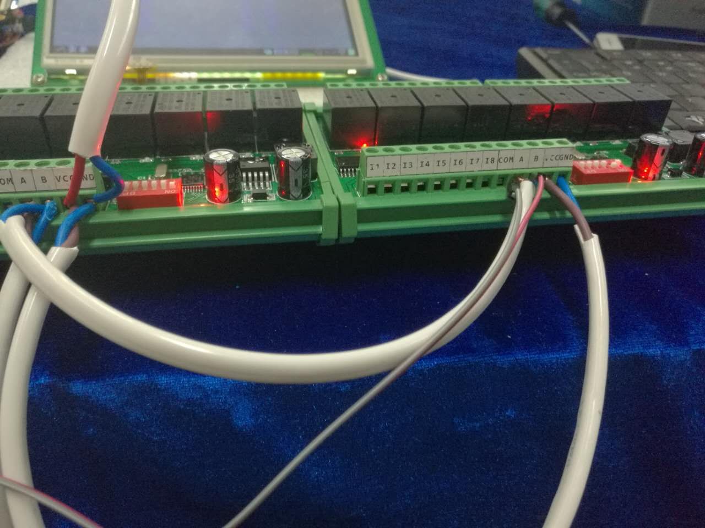
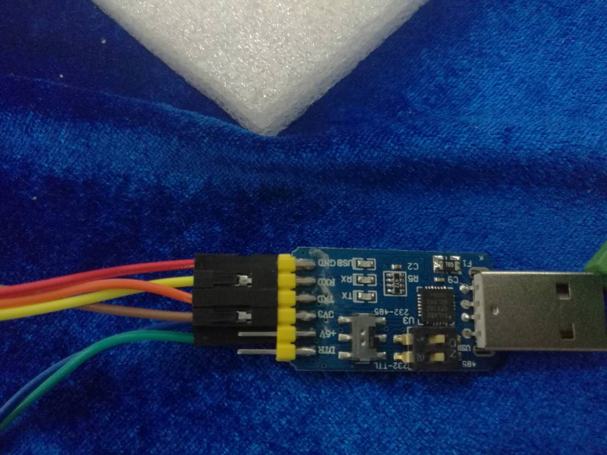
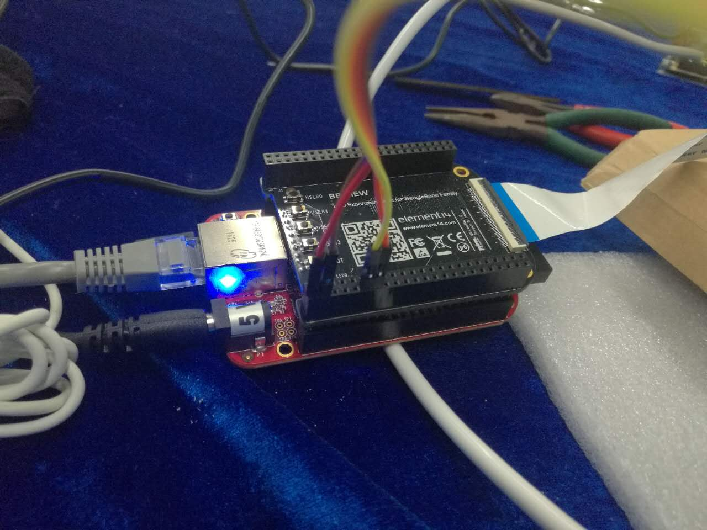
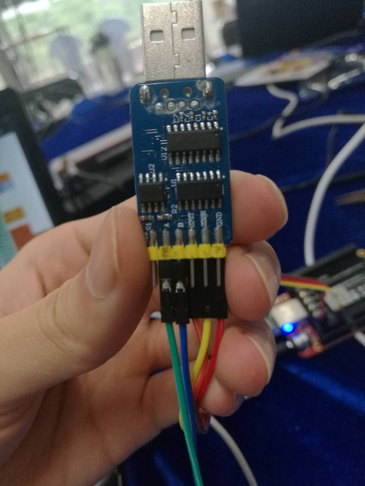

# 记录

## 配置BBB

### 使用windows pc操作狗板
* putty
```
1. usb连接后，先打开狗板usb文件夹，安装驱动
2. 下载putty，使用putty来通过usb操作狗板，以命令行操作。
3. Host Name（IP）：192.168.7.2  SSH
4. login as：root（或者用户名与密码）
5. 下载Xming，使用Xming可视化操作。Putty > X11 > Enable X11 forwarding
```
* windwos远程桌面：
usb控制：ip为192.168.7.2
局域网控制：ip路由分配

### 传输文件
使用FileZilla Client或者pscp 文件夹需要 -r, 文件名有空格My documents需要加双引号
```
pscp -r "E:\My documents\Tongji\project\py_back" root@192.168.7.2:/home/
```

### 有线上网
在文件etc/network/interface添加，用DHCP自动获取：

	auto eth0
	iface eth0 inet dhcp

/etc/resolv.conf添加，设置为你当地的DNS（好像不是必须的）
    
    nameserver 202.120.190.208
    nameserver 202.120.190.108

可以自动连接网络
静态ip：未完成
无线网络：未完成

### 串口


在文件/boot/uboot/uEnv.txt添加

	optargs=quiet drm.debug=7 capemgr.enable_partno=BB-UART4

重新启动linux 

    reboot
    
再查看串口情况

	ls -l /dev/ttyO*
	crw-rw---- 1 root tty 249, 0 Jan 1 01:18 /dev/ttyO0
	crw-rw---- 1 root dialout 249, 4 Jan 1 01:18 /dev/ttyO4

### 开机自启动程序

在etc/rc.local添加 

    python /home/debian/py_back/main.py &

查看后台程序

	ps aux | grep /home/debian/py_back/main.py

结束程序

    sudo kill number

### 安装中文字体

	apt-get install locales 
	dpkg-reconfigure locales 
	选择zh_CN UTF-8 UTF-8后保存退出 
	apt-get install ttf-arphic-uming 
	apt-get install ttf-wqy-zenhei 

### 狗板磁盘满了

发现是log文件夹下异常的大，可能是usb连接可视化xming的问题

	cd /var/log
	sudo su
	> kern.log
	> syslog

### 后台运行程序

结尾加&

	python main &

ps、jobs查看

	kill pi或者kill %n

## 连接

介绍三者连接情况
BBB-
[六合一多功能模块](https://detail.tmall.com/item.htm?id=44650961548&spm=a1z09.2.0.0.lxys3Z&_u=bps8j6nf729)
-继电器

### BBB串口
使用左边`01, 03, 11 13`


### 连接图
两个继电器并连









